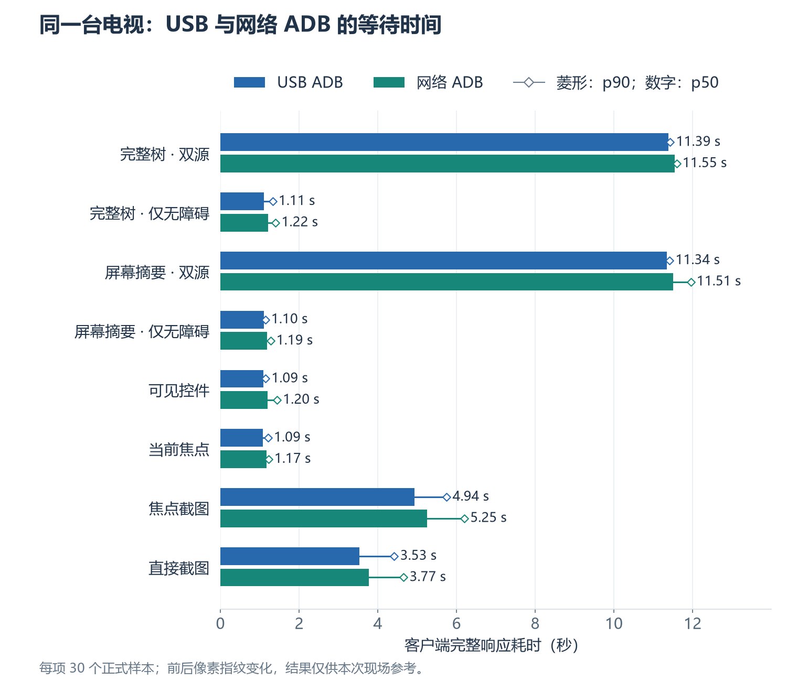
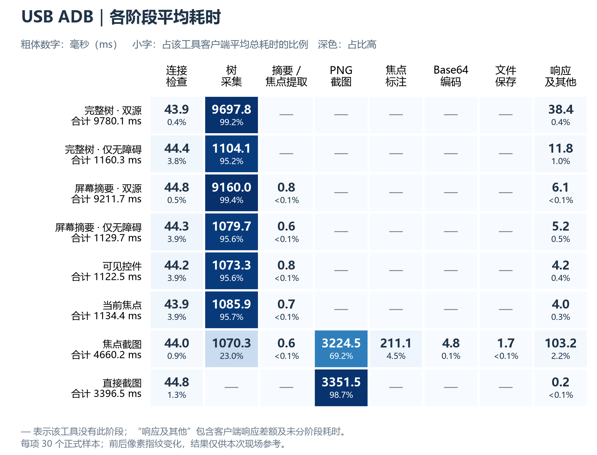
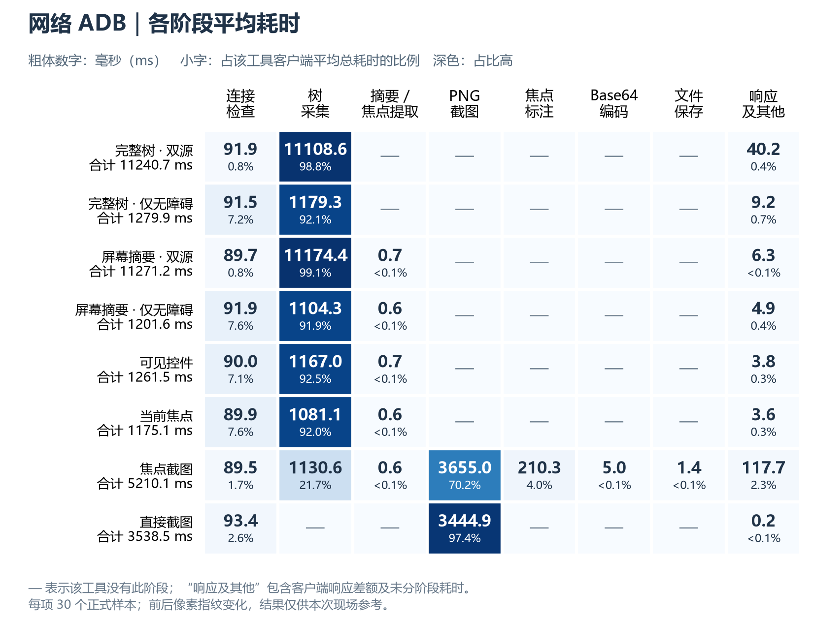
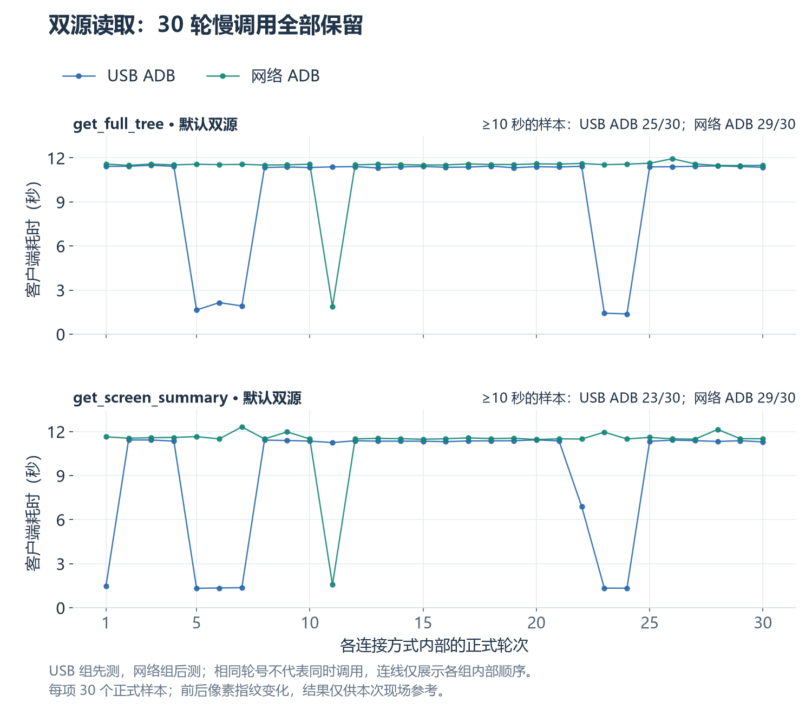
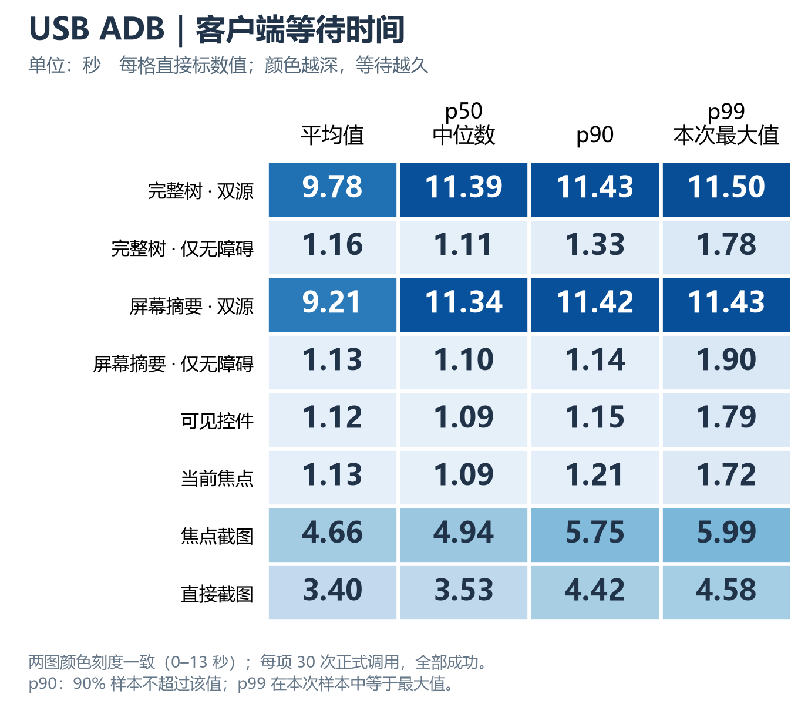
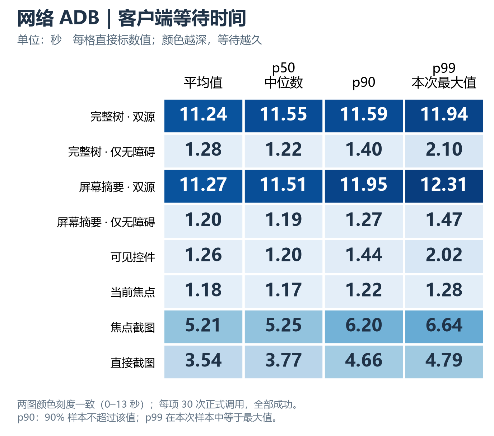

# MCP 脚本真机性能压测报告（2026-10-09）

## 结论

在同一台 R14G 电视（Android 16，1920×1080）上，USB ADB 与网络 ADB 的 MCP 读取耗时处于相近量级。仅读取无障碍树的工具 p50 约为 1.1–1.2 秒；默认双源（无障碍树 + dumpsys）完整树与屏幕摘要 p50 约为 11.3–11.5 秒；焦点截图 p50 约为 4.9–5.3 秒。

两种连接方式都完成了每项 30 次正式调用，未出现工具失败，且测试前后 `config.json` 字节一致。两次压测的窗口和焦点读数相同，但截图像素指纹不同，因此脚本将两组标记为场景未确认；以下数据适合作为本次现场性能参考，不能视为固定像素画面下的严格对照。

## 图表解读

点击图表可查看高清大图。原始统计表保留在下方，便于核对具体数值。

### 常见等待时间与较慢调用

条形长度和旁边数字表示 p50（中位数），空心菱形表示 p90（90% 的正式样本不超过该耗时）。横轴统一为秒，从零开始。仅无障碍读取通常约 1 秒，双源读取约 11 秒；本次两种连接方式的中位数相近。图表反映本次现场数据，仍受前后像素指纹变化和先后测试顺序的限制。

### 耗时主要花在哪个阶段

每格粗体数字是该阶段平均耗时（毫秒），下面的小字是“阶段平均耗时 ÷ 客户端平均总耗时”的百分比，颜色越深表示占比越高。每行左侧给出完整调用平均总耗时。七个已计时阶段分别列出，没有合并摘要、编码或保存；“—”表示该工具没有此阶段。

例如 USB 焦点截图中，PNG 截图平均占用 3224.5 毫秒（69.2%），树采集占用 1070.3 毫秒（23.0%），焦点标注占用 211.1 毫秒（4.5%）；编码约 4.8 毫秒，保存约 1.7 毫秒。小耗时阶段仍直接显示数值，便于比较。“响应及其他”包含未分阶段计时及客户端响应差额，不能当作纯网络或纯 MCP 协议耗时。这里采用平均值，口径与上一图的中位数不同。

### 双源读取的逐轮变化

每个点是一条正式样本，没有删去慢调用。完整树达到 10 秒的样本为 USB 25/30、网络 29/30；屏幕摘要为 USB 23/30、网络 29/30。这解释了两组双源读取的中位数都约为 11 秒，而 USB 组均值更低。USB 组先测、网络组后测；相同轮号仅是各组内部编号，不代表同时调用，曲线不能据此判定差异由连接方式造成。

## 测试条件

- 日期：2026-10-09；USB 组 11:44 开始，网络组 12:01 开始。
- 设备：同一台 R14G 电视，Android 16，分辨率 1920×1080。两种 ADB 入口读取到相同的设备固件指纹；本报告不记录设备序列号、网络地址或完整固件标识。
- 软件：Python 3.14.3、MCP SDK 1.30.0、uiautomator2 3.7.0。
- 每种连接方式依次执行 1 次预热和 30 次正式轮次；8 个待测项串行轮换顺序。每种方式共 240 次正式调用及 8 次预热。
- USB 组先运行，网络组随后运行；不并发压测同一台电视。
- 使用项目 `scripts/bench_mcp.py`，通过真实 stdio MCP 服务调用 5 个读取工具，其中完整树和屏幕摘要各含默认双源与仅无障碍模式；另测直接截图作为对照项。没有发送遥控器按键。
- 每组均为 248 条成功样本（含预热），正式样本成功率 100%；配置内容未改变。脚本退出码为 1，仅因前后场景指纹不同。

## 客户端耗时

以下两张图将每项调用的平均值、p50、p90 和 p99 分开展示，单位为秒，数字保留两位小数。两图使用相同颜色刻度，颜色越深表示客户端等待越久；点击可查看高清大图。

p50 是中位数，p90 表示 90% 的正式样本不超过该耗时。p99 使用最近秩法；每项只有 30 个正式样本，因此 p99 等于本次最大值，不能据此估计长期尾部延迟。两组按先后顺序测试，且前后像素指纹变化，不能将图中差异直接归因于连接方式。

展开精确数值表（毫秒）

单位为毫秒，格式为“均值 / p50 / p90 / p99”。

| 待测项 | USB ADB（mean / p50 / p90 / p99） | 网络 ADB（mean / p50 / p90 / p99） | 成功率 |
|---|---:|---:|---:|
| 完整树（默认双源） | 9780.1 / 11385.5 / 11431.9 / 11497.7 | 11240.7 / 11546.5 / 11594.9 / 11941.9 | 两组均 30/30 |
| 完整树（仅无障碍） | 1160.3 / 1105.1 / 1329.0 / 1781.3 | 1279.9 / 1219.1 / 1403.8 / 2101.3 | 两组均 30/30 |
| 屏幕摘要（默认双源） | 9211.7 / 11342.7 / 11416.1 / 11429.8 | 11271.2 / 11513.1 / 11953.9 / 12312.8 | 两组均 30/30 |
| 屏幕摘要（仅无障碍） | 1129.7 / 1101.5 / 1142.4 / 1898.1 | 1201.6 / 1186.8 / 1273.5 / 1466.7 | 两组均 30/30 |
| 可见控件 | 1122.5 / 1090.3 / 1148.5 / 1788.3 | 1261.5 / 1201.2 / 1440.5 / 2015.0 | 两组均 30/30 |
| 当前焦点 | 1134.4 / 1085.0 / 1211.7 / 1724.3 | 1175.1 / 1168.5 / 1222.1 / 1284.8 | 两组均 30/30 |
| 焦点截图 | 4660.2 / 4937.0 / 5751.1 / 5985.3 | 5210.1 / 5252.9 / 6200.4 / 6644.2 | 两组均 30/30 |
| 直接截图 | 3396.5 / 3534.7 / 4419.3 / 4576.7 | 3538.5 / 3771.5 / 4656.7 / 4791.0 | 两组均 30/30 |

`client_ms` 从 MCP 客户端发起调用计至完整响应返回；直接截图则从连接检查计至 PNG 返回。客户端耗时不是纯 ADB 传输时间。

## 阶段观察

- 双源完整树和屏幕摘要的 `capture_tree` 阶段 p50 约为 USB 11.29–11.30 秒、网络 11.41 秒；该采集阶段是这两类工具的主要耗时来源。
- 仅无障碍树读取的 `capture_tree` 阶段 p50 约为 USB 1.03–1.05 秒、网络 1.07–1.12 秒。
- `connect` 阶段 p50 在 USB 组约为 43 毫秒，在网络组约为 90 毫秒。该阶段包含项目现有连接检查流程，不等同于单纯的 USB 或 Wi-Fi 传输延迟。
- 焦点截图的 `screenshot` 阶段 p50 为 USB 3.48 秒、网络 3.73 秒，`mark` 阶段约 0.22 秒；PNG 截取与焦点标注构成其主要耗时。
- `client_ms - server_ms` 包含 MCP/stdio 序列化、传输、SDK 处理和调度等因素，不能直接解释为网络时延。

## 结果边界

1. 两种连接方式的窗口和焦点读数一致，但前后 PNG 像素 SHA-256 不一致，脚本按设计将 `scene_unchanged` 标为 `false`。因此这不是完全静止像素画面的严格 A/B 测试。
2. 测试按单设备串行执行，不测并发容量、吞吐量或多设备负载。
3. 当前结果适用于这台设备、当前固件、当前界面及本机 Python/MCP 环境；不能直接外推到其他电视或网络。
4. 原始 JSONL、stderr、截图及设备连接标识留在 Git 忽略的 `_temp/bench_mcp/`，没有纳入本报告或提交。

## GitHub Wiki 发布状态

报告已发布至 [TV-UITree Wiki](https://github.com/FasenChen/TV-UITree/wiki/MCP-Performance-Benchmark-2026-10-09)，并已加入 Wiki Home 索引。最新图表更新提交为 `6018c484990990c617a883da7010c98148300057`；客户端耗时新增 USB 和网络两张数值图，共六张图，毫秒表格保留为可展开内容。64 个客户端统计值已与 480 条正式样本核对，Wiki HTML 包含新增图片链接，发布图片校验值与本地一致。本次浏览器页面检查遇到 504 超时，未确认页面内图片渲染；此前阶段图已确认正常显示。图表沿用本次已有压测数据，没有重新运行设备测试。
